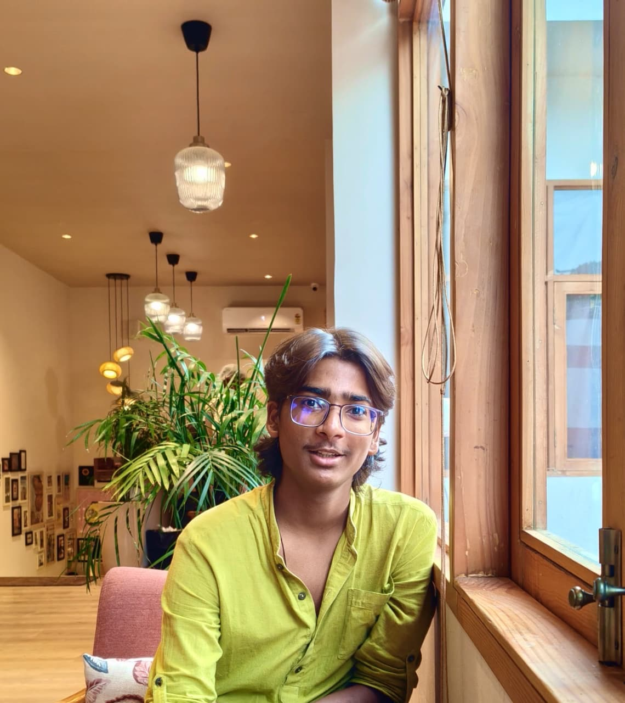

# Marutey Mani - Portfolio

<div align="center">
  

  <h3>CS & AI Student | Operator | Designer | Researcher</h3>
  <p>
    Plaksha University, Mohali<br/>
    Building at the intersection of engineering, operations, design, and social impact.
  </p>

  <p>
    <a href="https://www.linkedin.com/in/marutey-mani-7ab79b283/"></a>
    <a href="https://github.com/DisturbedSage5840C"></a>
    <a href="https://drive.google.com/drive/folders/1bQgFxzm_B3OMxLi-ZVbJGiARwwHuI-s8?usp=sharing"></a>
  </p>
</div>

---

## About

This is my personal portfolio built with Next.js 14 App Router, TypeScript, Tailwind CSS, and Framer Motion.

It showcases:
- Leadership and operational work across student, NGO, and social initiatives
- Project engineering experience in full-stack + AI systems
- Research and writing output, including publication in The Shillong Times
- Creative showcase placeholders for design, photography, reels, and videography

---

## Live Sections

- Hero
- About (with portrait panel)
- Experience
- Projects
- Research & Writing
- Leadership
- Awards
- Contact
- Dynamic Project Detail Pages
- Showcase Page

---

## Featured Projects

### 1) University Housekeeping Management System
- AI-powered campus hygiene compliance tracking
- Role-based dashboards and complaint prioritization
- NLP pipeline and predictive maintenance concepts

### 2) RWE Tracker
- Real-world evidence perception platform
- Multi-source ingestion and async analysis workflows
- Gap analysis across seven dimensions

---

## Research Highlight

- How Crypto Grew Up: Why It Might Finally Belong Inside Government
  - Published in The Shillong Times
  - Link: https://theshillongtimes.com/2025/11/27/how-crypto-grew-up-why-it-might-finally-belong-inside-government/

---

## Tech Stack

- Next.js 14 (App Router)
- TypeScript
- Tailwind CSS v3
- Framer Motion
- Google Fonts (DM Serif Display, Syne, IBM Plex Mono)

---

## Live Website

This portfolio is live on Vercel:

- Production URL: https://marutey-mani-portfolio.vercel.app
- Platform: Vercel (Next.js optimized hosting)

### Deployment Workflow

- The repository is connected to Vercel.
- Every push to the `main` branch automatically triggers a fresh production deployment.
- Vercel handles SSL/HTTPS, global CDN delivery, and build/runtime optimization.

### Notes

- If new media is added to `public/`, a normal push to GitHub is enough to publish it live.
- If needed, a custom domain can be connected directly from the Vercel project dashboard.

---

## Local Setup

### 1. Clone

```bash
git clone https://github.com/DisturbedSage5840C/marutey-mani-portfolio.git
cd marutey-mani-portfolio
```

### 2. Install

```bash
npm install
```

### 3. Run development server

```bash
npm run dev
```

Open http://localhost:3000

### 4. Production build

```bash
npm run build
npm run start
```

---

## Project Structure

```text
app/
  projects/[slug]/page.tsx
  showcase/page.tsx
  layout.tsx
  template.tsx
  page.tsx
components/
  About.tsx
  Hero.tsx
  Nav.tsx
  Projects.tsx
  ProjectPage.tsx
  Showcase.tsx
  CursorFx.tsx
  ...
lib/
  data.ts
  projects.ts
  showcase.ts
  animations.ts
public/
  images/marutey_photo.jpg
```

---

## Contact

- Email: maruteymani31@gmail.com
- LinkedIn: https://www.linkedin.com/in/marutey-mani-7ab79b283/
- GitHub: https://github.com/DisturbedSage5840C

---

## License

This project is for personal portfolio use.
