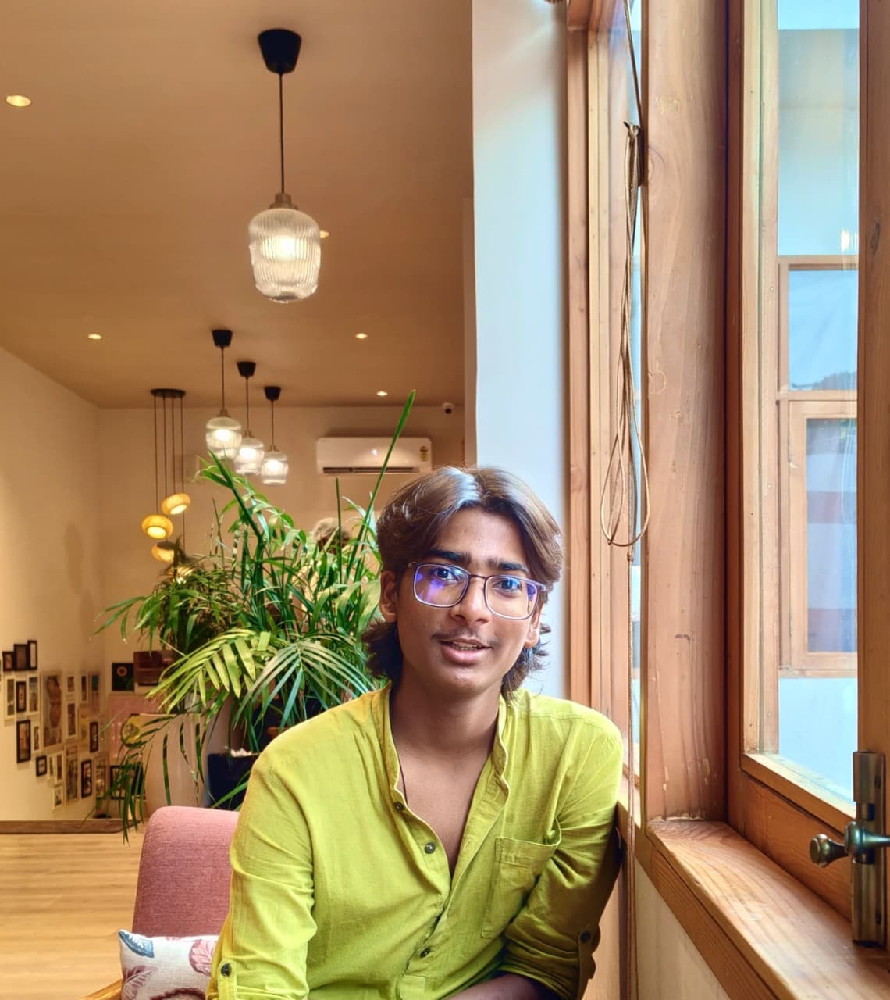

# Marutey Mani — Portfolio

<div align="center">
  

  <h3>CS & AI Student · Operator · Designer · Researcher</h3>
  <p>
    Plaksha University, Mohali<br/>
    Building at the intersection of engineering, operations, design, and social impact.
  </p>

  <p>
    <a href="https://marutey-mani-portfolio.vercel.app"></a>
    <a href="https://www.linkedin.com/in/marutey-mani-7ab79b283/"></a>
    <a href="https://github.com/DisturbedSage5840C"></a>
  </p>
</div>

---

## Overview

Personal portfolio built with Next.js 14 App Router — dark, immersive, 3D-driven. Every section uses scroll-triggered GSAP animations, a morphing WebGL particle field, and floating wireframe objects as a persistent background scene.

---

## Sections

| Section | Description |
|---|---|
| **Hero** | Full-screen with distorted 3D sphere, orbiting ring, particle halo, GSAP character-by-character name reveal |
| **About** | Three-column layout — bio, portrait, info table with tilt effect |
| **Experience** | Horizontal scroll rail (GSAP pinned) — 8 cards sliding right-to-left as you scroll down |
| **Projects** | 2-column grid with scroll-triggered stagger reveal, 3D tilt on hover |
| **Research & Writing** | Typewriter reveals on scroll, published article link |
| **Leadership** | 3-column grid with hover accent bar, stagger animation |
| **Awards** | Horizontal row list with slide-in animation, purple→cyan hover |
| **Contact** | Clean link grid |
| **Project Detail Pages** | `/projects/[slug]` — stats bar, problem/solution/architecture, features grid, tech stack with category legend |
| **Showcase** | `/showcase` — masonry 3-column grid, filterable by category |

---

## Featured Projects

### 1. University Housekeeping Management System
AI-powered campus hygiene compliance tracker — role-based dashboards (Admin / Staff / Student), ML complaint classification (12 categories, ~85% accuracy), NLP sentiment pipeline, 2-way photo verification, predictive maintenance. 59 source files, 11,500+ lines, 6 Docker services.

**Stack:** Node.js · Express · FastAPI · Python · PostgreSQL 16 · Redis · Docker · scikit-learn · spaCy · React Native

### 2. RWE Tracker — Real-World Evidence Platform
Quantifies the gap between clinical trial claims and real-world patient perception for monitored drugs. Ingests from OpenFDA, ClinicalTrials.gov, and Reddit asynchronously; NLP pipeline (VADER + RoBERTa + SentenceTransformers); gap analysis across 7 clinical dimensions.

**Stack:** Next.js 14 · FastAPI · Celery · PostgreSQL · Redis · RoBERTa · Docker · GitHub Actions

---

## Tech Stack

### Framework & Language
- Next.js 14 (App Router, SSG)
- TypeScript
- Tailwind CSS v3

### Animation & 3D
- GSAP + ScrollTrigger — scroll-driven animations, horizontal pin, stagger reveals
- Three.js + React Three Fiber — WebGL particle morphing field, floating wireframe objects
- `@react-three/postprocessing` — Bloom, Chromatic Aberration, Vignette
- Framer Motion — page transitions, Showcase grid
- Lenis — smooth scroll integrated with GSAP ticker

### Fonts
- Space Grotesk (headings / body)
- Space Mono (labels, tags, monospaced UI)
- DM Serif Display (loaded, serif accent)

### Deployment
- Vercel (auto-deploy on push to `main`)
- Production: https://marutey-mani-portfolio.vercel.app

---

## Project Structure

```
app/
  layout.tsx              # Fonts, SceneBackground, Nav, LenisProvider
  page.tsx                # Home — all sections composed
  template.tsx
  projects/
    [slug]/page.tsx       # Dynamic SSG project detail pages
  showcase/
    page.tsx              # Showcase gallery page
components/
  Hero.tsx                # GSAP name reveal, count-up stats, magnetic CTAs
  About.tsx               # Portrait panel, skills grid
  Experience.tsx          # Horizontal scroll rail (GSAP pin)
  Projects.tsx            # 2-col grid, scroll-triggered stagger
  ProjectPage.tsx         # Project detail renderer
  Research.tsx            # Typewriter reveal items
  Leadership.tsx          # 3-col grid with hover effects
  Awards.tsx              # Row list with slide-in animation
  Showcase.tsx            # Masonry grid, category filter
  Nav.tsx                 # Fixed nav, scroll-aware blur
  Contact.tsx
  Footer.tsx
  CursorFx.tsx            # Custom cursor with trail
  providers/
    LenisProvider.tsx     # Lenis + GSAP ScrollTrigger sync
    PageTransition.tsx
    RouteTransitionProvider.tsx
  three/
    SceneBackground.tsx   # Fixed WebGL canvas — morphing particle field
                          # + floating wireframe torusKnot, icosahedron, octahedron
    HeroSphere.tsx        # Hero-local canvas — distorted sphere + orbit ring + halo
  ui/
    RevealOnScroll.tsx
lib/
  data.ts                 # All section content (hero, about, experience, projects, …)
  projects.ts             # Full project detail data (slug, stats, tech, features)
  showcase.ts             # Showcase items and categories
public/
  images/
    marutey_photo.jpg
```

---

## Local Setup

```bash
# Clone
git clone https://github.com/DisturbedSage5840C/marutey-mani-portfolio.git
cd marutey-mani-portfolio

# Install
npm install

# Dev server
npm run dev
# → http://localhost:3000

# Production build
npm run build
npm run start
```

---

## Deployment

Connected to Vercel. Every push to `main` triggers an automatic production deployment with full SSG rebuild.

---

## Contact

- Email: maruteymani31@gmail.com
- LinkedIn: https://www.linkedin.com/in/marutey-mani-7ab79b283/
- GitHub: https://github.com/DisturbedSage5840C

---

*Personal portfolio — not open for reuse without permission.*
